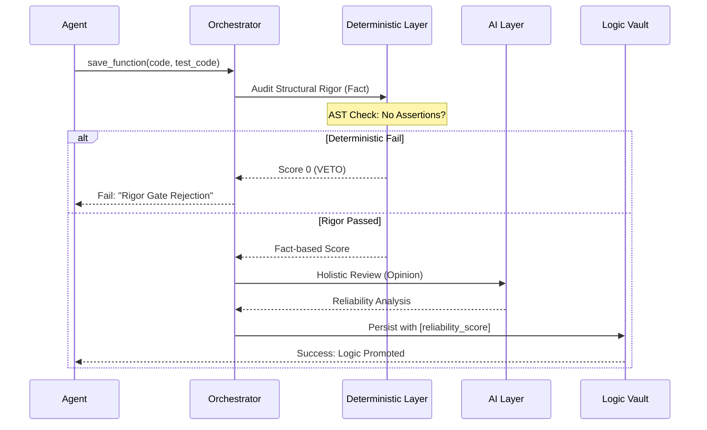

# 🏗️ LogicHive System Architecture

LogicHive is a **Logic Orchestration Layer** that sits between high-intelligence AI Agents and persistent storage. Its primary goal is to solve "Logic Rot" and "Memory Fragmentation" through structural rigor.

---

## 🛡️ The Philosophy: Logic over Sophistry

In an AI-augmented world, the cost of code generation is near zero, but the cost of **validation** is at an all-time high. LogicHive is built on the belief that **AI is a fantastic adapter, but a dangerous judge.** 

We prioritize **Facts (AST, Runtime)** over **Opinions (LLM heurustics)**.

---

## 1. High-Level Architecture

LogicHive follows a "Post-RAG Paradigm" where the unit of retrieval is a **Verified Logic Unit (VLU)**.

---

## 2. Evolution of the Quality Gate (The War Story)

The current 4:3:2:1 weighted gate is the result of three distinct "Failures" during the development of LogicHive. These rounds prove why a "Deterministic Veto" is necessary.

### Round 1: Naive Trust (AI-only)
- **Attempt**: Asked the AI, "Is this code high quality and well-tested?"
- **Fail**: The AI rewarded code with `assert True` or no assertions at all, as long as the code *looked* clean and professional.
- **Lesson**: AI cannot distinguish between "Pro-looking comments" and "Rigorous logic."

### Round 2: Persona Hardening (Forensic Auditor)
- **Attempt**: Changed the AI persona to a "Hostile Forensic Auditor" and gave it "Veto Power."
- **Fail**: The AI was fooled by "Complex Deceptions"—code that uses bitwise operators or meta-programming to perform simple identity functions. The AI thought it was "sophisticated engineering."
- **Lesson**: AI-only evaluation is subjective and non-deterministic. It generates **Sophistry**, not Logic.

### Round 3: Hybrid Deterministic Veto (Current)
- **Solution**: Introduced the **Deterministic Layer**. We use Python's `ast` module to:
  1. Count actual `assert` statements.
  2. Detect "Hollow Methods" (methods with only `pass`, `...`, or trivial identity returns).
- **Outcome**: If the Deterministic Layer finds **zero assertions**, the asset is REJECTED instantly, regardless of how much the AI "likes" it.

---

## 3. The Validation Pipeline

---

## 4. Design Philosophies: "Giving Up to Seek More"

To build a professional-grade vault, we explicitly "Gave Up" on certain common expectations:

1. **Giving up on "AI Omniscience"**: We don't expect AI toExtract metadata perfectly. Instead, we let the Agent (Cursor/Antigravity) do the heavy lifting of interpretation.
2. **Giving up on "Visual Excellence" for internals**: The CLI and MCP are the primary UI. We prioritize internal structural integrity over dashboard graphics.
3. **Giving up on "Zero-tests"**: Prototyping is fine (Draft mode), but we give up the idea that "Untested code is an asset." In LogicHive, it's a liability.

---

## 🚀 The Synergy: LogicHive + SharedMemoryServer
While **SharedMemoryServer** provides the "Contextual Reasoning Memory" (the *Who* and *Why*), **LogicHive** provides the "Verified Logic Atoms" (the *How*). 

Together, they form a complete Agentic Infrastructure:
- **SharedMemory**: Facts & Narrative.
- **LogicHive**: Code & Verification.
