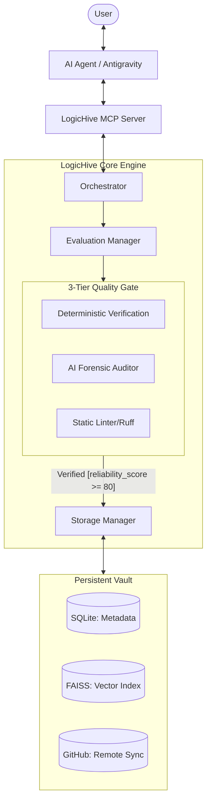
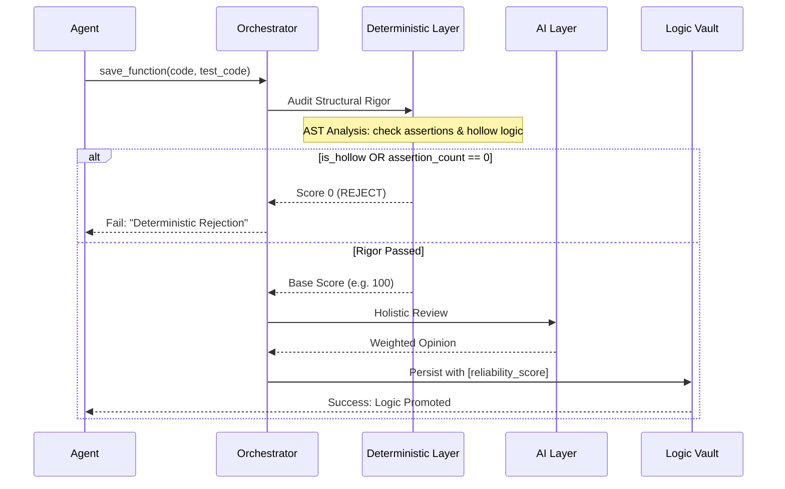

# 🏗️ LogicHive System Architecture

LogicHive is designed as a **Logic Orchestration Layer** that sits between high-intelligence AI Agents and persistent storage. Its primary goal is to solve the "Logic Rot" and "Memory Fragmentation" problems inherent in current RAG-based AI workflows.

## 1. High-Level Overview

LogicHive follows a "Post-RAG Paradigm" where the unit of retrieval is not a document, but a **Verified Logic Unit (VLU)**.

---

## 2. The Validation Pipeline (Rigor Gate)

LogicHive implements a **Deterministic Veto** policy. Unlike naive AI-only evaluation, LogicHive enforces structural rigor before accepting "subjective" AI opinions.

---

## 3. Core Design Philosophies

### A. Facts over Opinions
We believe LLM evaluations are non-deterministic and can be prone to "Sophistry" (sounding correct but lacking substance). LogicHive uses **AST (Abstract Syntax Tree)** parsing to prove that:
- Tests actually exist (Assertion count).
- Code is not performative (Hollow method detection).

### B. Anti-Rot (Software Preservation)
Logic is a living asset. LogicHive includes background audit tools (`stabilize_vault.py`) that periodically re-verify assets against shifting runtime environments.

### C. Contextual Isolation
Multi-tenant security is built-in. Project metadata ensures that proprietary logic from Project A never leaks into the suggestion context of Project B, even within the same vector space.

---

## 🚀 Future Vision: Auto-Dev Factory
LogicHive is evolving from a storage hub to a **Self-Optimizing Factory**.
1. **Discovery**: Find legacy logic.
2. **Adaptation**: Auto-refactor unit to match current project context.
3. **Professionalization**: Auto-generate missing tests to promote logic to "Verified" status.
