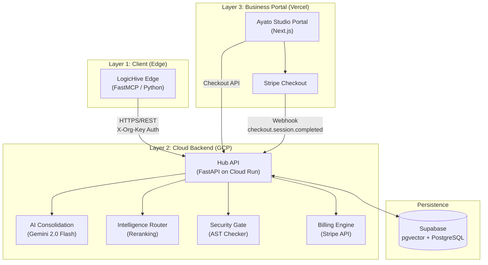

# LogicHive Architecture Overview (Hybrid Edge-Cloud)

> [!NOTE]
> **ポートフォリオ用アーカイブ注記**
> 本ドキュメントは、プロジェクトのシステム構成を詳述した技術設計書です。
> 最新の実装状況を反映した最終ドラフト版であり、実際のソースコード構造（`backend/` 配下等）と対照して技術力の証明として活用してください。

**最終更新日**: 2026-02-28
**バージョン**: 4.0.0

---

## 1. Product Vision

### 1.1 ビジョン
**LogicHive** は、**AIエージェントが生成したコードを「書き捨てない」ためのインフラ**である。
Cursor、Antigravity、Claude Desktop などのMCPクライアント環境から、プログラミング資産をシームレスに蓄積・再利用でき、毎回同じコードを生成し直すリソースの無駄を防ぐ。

知財（IP）の保護とセキュリティの観点から、アーキテクチャを「エージェント側のローカル環境（Edge）」と「処理と記憶を司るクラウド環境（Hub）」に分離。ユーザーの環境からAPIキーを流出させることなく、高度な推論とセマンティック検索を提供する。

### 1.2 The Thin-Proxy Shift (Stateless Edge 原則)
SaaSとしての体験を提供しつつ、運営コストを最小化し、ユーザー環境の依存関係をゼロにするためのパラダイムシフト。

*   **Stateless Edge Proxy**: ローカル環境（Edge）から DuckDB や Vector DB を完全に排除。依存関係を最小化し、インストール後即座に稼働する「薄いプロキシ」へと変貌した。
*   **Intelligence-Driven Global Storage (Supabase)**: 世界中の関数資産は Supabase (PostgreSQL + pgvector) を『インテリジェンス・バンク』として一元管理。
*   **Hybrid Billing Model (Static Free / LLM Metered)**: セキュリティチェックや基本的なコード保存は無料で提供し、LLMによる高度な推論（メタデータ抽出、テスト生成、セマンティック検索）のみを従量課金対象とする。
*   **Cloud Intelligence Hub**: すべての知能ロジックをクラウドへ集約し、Edge側での複雑な設定（Embeddingモデルのダウンロード等）を不要にした。

### 1.3 設計方針（優先度）
1.  **UXファースト (No BYOK)**: ユーザーにAPIキー設定を強引に求めず、運営側のインフラで即座に価値を提供する。
2.  **IP（知的財産）の保護**: 知能ロジックと推論指示（プロンプト）をGCPエンドポイントの裏側に配置し、解析手法を秘匿する。
3.  **スケーラビリティ**: ローカル環境のDB破損や環境不整合のリスクを排除し、複数端末での利用を容易にする。

### 1.4 デザインフィロソフィ
*   **Edge Compute Utilization**: ユーザーのローカルPCリソースを最大限活用する。
*   **Direct Intelligence**: 複雑な往復通信を廃止し、クラウド側で推論を完結させてレスポンス速度を向上。
*   **Draft First**: 高品質な関数の完成を待つよりも、下書き（Logic Draft）がそこにあることを優先。品質はクラウド側の知能が評価・選別する。
*   **MIT License Agreement**: 無料利用の対価として、登録コードへのMITライセンス付与に同意してもらう。

### 1.5 Security & Defense (Scraping Guard)
MVPフェーズにおける利便性（APIキー不要）と資産保護を両立するため、**「Search -> Mask -> Get」**の多層防御フローを採用。
*   **Data Masking**: 検索結果からはソースコードを完全に除去し、メタデータのみを返却。
*   **Per-IP Rate Limiting**: 検索（10回/分）およびコード取得（5回/分）の頻度をIP単位で制限し、プログラムによる全件抽出を阻止。

---

## 2. システム構成：三位一体の疎結合アーキテクチャ

LogicHiveは、役割ごとに完全に分離された3つのレイヤーで構成される。



### Layer 1: Edge Client (ローカル環境)
- **リポジトリ**: `LogicHive-Edge` (Public / OSS)
- **役割**: 開発者のローカル環境で関数をキャプチャし、Hubと通信するステートレス・プロキシ。
- **特徴**: MCP対応、FastMCP ベース、依存関係が非常に軽く、DuckDB/Local Embeddingは非搭載。
- **主要コンポーネント**: `mcp_server.py`, `orchestrator.py`, `sync.py`
- **MCP Tools**: `save_function`, `search_functions`, `get_function`, `smart_search_and_get`, `list_functions`, `delete_function`, `get_function_details`

### Layer 2: Logic Backend (GCP Cloud Run)
- **リポジトリ**: `LogicHive-Hub-Private` (Private)
- **役割**: ロジックの永続化、AIによる品質評価（スコアリング）、セマンティック検索、課金管理。
- **特徴**: ステートレス、水平スケーリング、GitHub Actions による自動デプロイ。
- **主要コンポーネント**: 
  - `app.py` (FastAPI, 32エンドポイント/モデル)
  - `supabase_api.py` (Storage Engine, 15メソッド)
  - `stripe_api.py` (課金管理)
  - `consolidation.py` (AI メタデータ生成)
  - `router.py` (リランキング)
  - `sandbox.py` (セキュアコード実行)

### Layer 3: Business Portal (Vercel)
- **リポジトリ**: `ayato_studio_portal` (Private)
- **役割**: 集客（LP）、Stripe決済、組織管理、APIキーのライフサイクル管理。
- **特徴**: Next.js / React / TypeScript、Supabase Auth、Vercel にデプロイ。

---

## 3. Dual-Repo Architecture

知的財産保護のため、システムは2つのリポジトリに物理的に分離されている。

| リポジトリ | 公開範囲 | 内容 | デプロイ先 |
|:--|:--|:--|:--|
| `LogicHive-Edge` | Public (OSS) | MCP サーバー、ローカル処理 | ユーザーの PC |
| `LogicHive-Hub-Private` | Private | 知能ロジック、課金、セキュリティ | GCP Cloud Run |

**分離の目的**:
- Hub の評価プロンプト、リランキングアルゴリズム、ブースト値を秘匿
- Edge はスタンドアロンの OSS として独立して動作可能
- セキュリティのアタックサーフェスを最小化

---

## 4. データフロー

### 4.1 関数保存フロー (Push)
```
Edge (save_function) 
  → Hub (/api/v1/functions/push)
    → AST Security Check (secret/dangerous calls) - [FREE]
    → If Quota Allowed:
        → AI Metadata Generation (Gemini 3)
        → AI Evaluation & Sandboxed Test (Docker)
        → Embedding 生成 (768d)
    → Supabase Upsert (pgvector)
    → Quota Increment (LLM feature only)
```

### 4.2 関数検索フロー (Search)
```
Edge (search_functions / smart_search_and_get)
  → Hub (/api/v1/functions/search)
    → If Quota Allowed:
        → Query Embedding 生成 & Vector Search
    → Else / Fallback:
        → Static Search (ILIKE match) - [FREE]
    → Popularity-biased Reranking
    → Code Masking (ソースコード秘匿)
    → メタデータのみ返却
```

### 4.3 課金フロー (Billing)
```
Portal (PricingTable → CheckoutButton)
  → Hub (/api/v1/billing/checkout)
    → Stripe Checkout Session 生成
    → ユーザーを Stripe 決済ページへリダイレクト
    → 決済完了
    → Stripe Webhook → Hub (/api/v1/billing/webhook)
      → 署名検証 (whsec_...)
      → Supabase: plan_type, request_limit 更新, usage_count リセット
```

---

## 5. Monetization (SaaS 課金モデル)

### 5.1 料金体系

| プラン | 月額 | LLM機能制限 | 基本機能 |
|:--|:--|:--|:--|
| **Free** | $0 | 100 requests/mo | 無制限 |
| **Basic** | $9 | 1,000 requests/mo | 無制限 |
| **Pro** | $14 | 10,000 requests/mo | 無制限 |

- **基本機能**: ASTチェック、静的検索、コードの手動保存、CRUD操作。
- **LLM機能**: 自動タグ付け、品質評価、サンドボックス実行、セマンティック検索（ベクトル検索）。

### 5.3 コスト構造

| 項目 | 月額 | 備考 |
|:--|:--|:--|
| GCP Cloud Run | ~$0 | 無料枠内 |
| Supabase | $0 | 無料枠（500MB） |
| Google AI API | $0 | 無料枠 |
| Stripe 手数料 | 売上の3.6% | 決済時のみ |

---

## 6. セキュリティアーキテクチャ

| レイヤー | 機能 | 実装場所 |
|:--|:--|:--|
| **AST 静的解析** | APIキー・シークレット検出、危険な関数呼び出し遮断 | `core/security.py` |
| **IP レート制限** | Search: 10回/分, Get: 5回/分 | `hub/app.py` (RateLimiter) |
| **コードマスキング** | 検索結果からソースコードを除去 | `hub/app.py` (functions_search) |
| **Stripe 署名検証** | Webhook の真正性を `whsec_...` で暗号検証 | `hub/stripe_api.py` |
| **CORS 制御** | `localhost`, `ayato-studio.ai` のみ許可 | `hub/app.py` (CORSMiddleware) |
| **X-Org-Key 認証** | 組織APIキーによるリクエスト認証 | `hub/app.py` (get_org_id) |
| **MIT ライセンス同意** | Edge 初回起動時にダイアログ表示 | `edge/mcp_server.py` |

---

## 7. 環境変数一覧

### Hub (Cloud Run)
| 変数名 | 用途 |
|:--|:--|
| `PORT` | サーバーポート（Cloud Run は自動設定） |
| `SUPABASE_URL` | Supabase プロジェクト URL |
| `SUPABASE_SERVICE_ROLE_KEY` | Supabase サービスロールキー |
| `FS_GEMINI_API_KEY` | Google AI API キー（Embedding + 推論） |
| `MODEL_TYPE` | 使用モデル（デフォルト: `gemini-2.0-flash`） |
| `FS_EMBEDDING_MODEL_ID` | Embedding モデル（`gemini-embedding-001`） |
| `STRIPE_API_KEY` | Stripe API シークレットキー |
| `STRIPE_WEBHOOK_SECRET` | Stripe Webhook 署名シークレット |

### Portal (Vercel)
| 変数名 | 用途 |
|:--|:--|
| `NEXT_PUBLIC_LOGICHIVE_HUB_URL` | Hub の本番 URL |
| `NEXT_PUBLIC_SUPABASE_URL` | Supabase プロジェクト URL |
| `NEXT_PUBLIC_SUPABASE_ANON_KEY` | Supabase 匿名キー |

---

## 8. CI/CD パイプライン

### Hub デプロイ (GitHub Actions)
```
git push (master)
  → GitHub Actions (deploy_hub.yml)
    → Google Auth (サービスアカウント)
    → Docker Build & Push (Artifact Registry: logichive)
    → gcloud run deploy
      → 環境変数注入 (GitHub Secrets)
      → Cloud Run サービス更新
```

### Portal デプロイ (Vercel)
```
git push (main)
  → Vercel 自動ビルド
    → Next.js Build
    → 環境変数注入 (Vercel Environment Variables)
    → デプロイ完了
```

---

## 9. DB スキーマ概要 (Supabase)

### `organizations` テーブル
| カラム | 型 | デフォルト | 説明 |
|:--|:--|:--|:--|
| `id` | UUID | auto | 組織ID |
| `name` | TEXT | - | 組織名 |
| `api_key_hash` | TEXT | - | APIキーのSHA-256ハッシュ |
| `stripe_customer_id` | TEXT | NULL | Stripe 顧客ID |
| `plan_type` | TEXT | `'free'` | `'free'`, `'basic'`, `'pro'` |
| `request_limit` | INT | 100 | 月間リクエスト上限 |
| `current_usage_count` | INT | 0 | 当月の使用回数 |
| `usage_reset_date` | TIMESTAMPTZ | `now()` | 最終リセット日（Lazy Reset用） |
| `status` | TEXT | `'active'` | `'active'`, `'frozen'` |

### `logichive_functions` テーブル
| カラム | 型 | 説明 |
|:--|:--|:--|
| `id` | UUID | 関数ID |
| `organization_id` | UUID | 所属組織（マルチテナンシー） |
| `name` | TEXT | 関数名 |
| `code` | TEXT | ソースコード |
| `description` | TEXT | AI生成の説明文 |
| `tags` | JSONB | AI生成のタグ |
| `embedding` | VECTOR(768) | セマンティック検索用ベクトル |
| `reliability_score` | FLOAT | 品質スコア |
| `call_count` | INT | 利用回数（人気度） |
