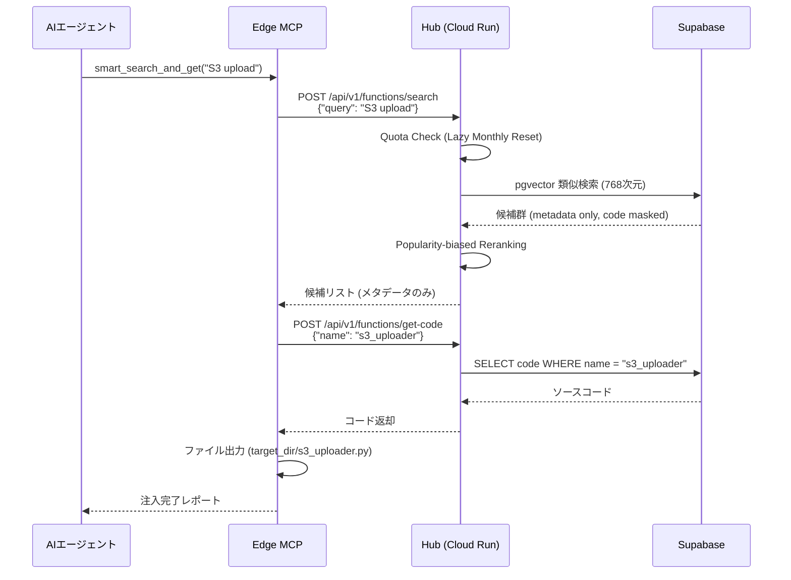

# Edge Design (Local Client Architecture)

**最終更新日**: 2026-02-28
**バージョン**: 4.0.0

---

## 1. 責務とコア概念

Edge層は、ユーザーのローカルPC環境で動作する**OSS（Public）のMCPサーバー**である。

### 主な責務
1.  **AIエージェントとのインターフェース**: FastMCP プロトコルを介して Cursor / Gemini Desktop / Antigravity 等のエディタと通信する。
2.  **ステートレス・プロキシ**: ローカルにデータベースを持たず、全ての検索・保存リクエストを Hub へ中継する。
3.  **シームレスなクラウド連携**: Hub（GCP Cloud Run）と REST 通信し、Supabase 上のグローバル関数バンクに対する検索・保存（Push）を実行する。
4.  **ゼロ・インストール・フットプリント**: 複雑な依存関係（DuckDB, Local Embeddings）を排除し、軽量なバイナリ/スクリプトとして動作する。
5.  **MIT ライセンス同意**: 初回起動時にダイアログを表示し、登録コードの MIT ライセンスへの同意を取得する。

---

## 2. コンポーネント詳細

### 2.1 MCP Server (`backend/edge/mcp_server.py`)
Python / FastMCP ベースの MCP サーバー。エディタに直接登録されるエントリーポイント。

*   **7つのMCP Tools を公開**:
    | Tool | 説明 |
    |:--|:--|
    | `save_function` | 関数を Hub (SaaS) へ保存 |
    | `search_functions` | セマンティック/キーワード検索 (Hub連携) |
    | `get_function` | 関数のソースコードを Hub から取得 |
    | `get_function_details` | 関数の完全なメタデータを取得 |
    | `smart_search_and_get` | **主要プロトコル**: 検索 → Hub リランキング → 選択 → 注入 |
    | `list_functions` | 組織内の関数一覧取得 |
    | `delete_function` | 関数を Hub から削除 |

*   **FastMCP 初期化**: `FastMCP("LogicHive")` - 依存関係を極小化
*   **Transport**: `TRANSPORT` 設定（`stdio` / `sse`）に基づいて起動

### 2.2 Orchestrator (`backend/edge/orchestrator.py`)
全ての MCP Tool の実装ロジックを集約するコアモジュール（13,244 bytes）。

*   `do_save_impl()`: バリデーション → Hub Push (/api/v1/functions/push)
*   `do_search_impl()`: Hub Semantic Search (/api/v1/functions/search)
*   `do_get_impl()`: Hub Retrieval (/api/v1/functions/get_code)
*   `do_smart_get_impl()`: Hub連携型インテリジェント検索 → ファイル注入
*   `do_list_impl()`: Hub Listing (/api/v1/functions/list)
*   `do_delete_impl()`: Hub Deletion (/api/v1/functions/delete)

### 2.3 Sync Engine (`backend/edge/sync.py`)
Hub（Cloud Run）との REST 通信を担当するモジュール（9,696 bytes）。

*   **Hub Push**: ローカルで保存した関数を Hub の `/api/v1/functions/push` へ送信
*   **Hub Search**: Hub の `/api/v1/functions/search` を呼び出してグローバル検索を実行
*   **Hub Get Code**: Hub の `/api/v1/functions/get-code` で特定関数のコードを取得
*   **X-Org-Key 認証**: 組織APIキーを `X-Org-Key` ヘッダーに付与してリクエスト
*   **エラーハンドリング**: HTTP 402（クォータ超過）, 403（認証失敗）, 500（サーバーエラー）に対応

### 2.4 Vector DB (`backend/edge/vector_db.py`)
DuckDB ベースのローカルベクトルデータベース。

*   **Embedding**: `fastembed` を使用したローカル埋め込み生成
*   **類似検索**: DuckDB のベクトル距離関数による類似度計算
*   **キャッシュ役割**: Hub のグローバルストレージの前段キャッシュとして機能

### 2.5 その他のコンポーネント

| ファイル | 役割 |
|:--|:--|
| `generator.py` | 代码パッケージ生成 (Local Storage への注入) |
| `global_search.py` | Hub 検索 API の Async ラッパー |
| `manager.py` | MCP サーバーのクライアント登録/解除管理 |
| `coordinator.py` | 複数コンポーネント間の調整 |

---

## 3. smart_search_and_get フロー（Edge から見た全体像）

`smart_search_and_get` は、Edge の最も重要な主要プロトコルである。



**所要時間**: 約 2-5 秒（ネットワーク込み）
**従来の再生成**: 15-30 分 + デバッグ

---

## 4. データモデル (DuckDB Schema)

`functions` テーブルを中心に構成される。

---

## 4. データ永続化の廃止 (Stateless Proxy)

バージョン 4.0.0 より、Edge 側での **DuckDB / Vector DB は完全に廃止** されました。
全てのデータは Hub 側の Supabase で一元管理され、Edge はリクエストとレスポンスを変換するステートレスなプロキシとして動作します。
これにより、複数デバイス間での同期設定が不要になり、環境構築のコストが大幅に削減されました。

---

## 5. 起動モード

### 5.1 EXE モード（Frozen）
PyInstaller でビルドされたスタンドアロン実行可能ファイル。
- 初回起動時に MIT ライセンス同意ダイアログを表示（Windows `MessageBoxW`）
- `mcp_config_logic_hive.json` を自動生成
- ログファイル `logichive.log` を EXE フォルダに出力

### 5.2 スクリプトモード（開発用）
```bash
uv run python -m edge.mcp_server
```
- `core.config.TRANSPORT` の設定に基づいて `stdio` or `sse` で起動

---

## 6. デプロイメント・フットプリントとセキュリティ境界

### GitHub 上（Public リポジトリ）に公開されるもの
- `backend/edge/` : MCP サーバー、オーケストレーター、同期エンジン
- `backend/core/` : 共有設定、セキュリティチェッカー
- `pyproject.toml`, `README.md`, `LICENSE` : パッケージ管理
- `mcp_config_logic_hive.json` : MCP クライアント設定テンプレート

### GitHub 上に配置してはならないもの
- **`.env` / `token_secret.txt`**: ユーザーの API キー（Google Gemini 等）
- **Hub 固有のロジック**: リランキングプロンプト、評価アルゴリズム、Stripe 設定等は `LogicHive-Hub-Private` に完全分離済み

---

## 7. 環境変数

| 変数名 | 用途 | 必須 |
|:--|:--|:--|
| `LOGICHIVE_HUB_URL` | Hub の URL | Yes |
| `LOGICHIVE_ORG_KEY` | 組織 API キー | Yes |
| `FS_GEMINI_API_KEY` | Google AI API キー（BYOK / ローカル推論用） | Optional |
| `TRANSPORT` | MCP Transport 方式（`stdio` / `sse`） | No (default: `stdio`) |
