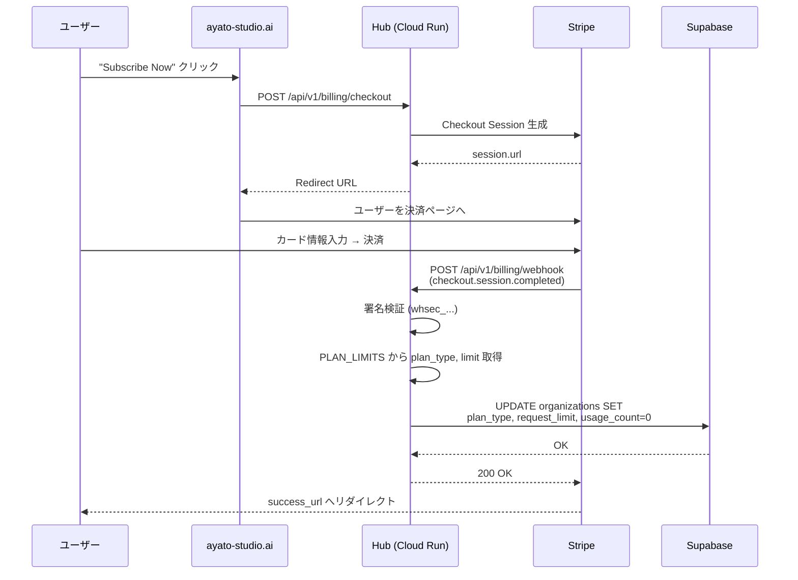
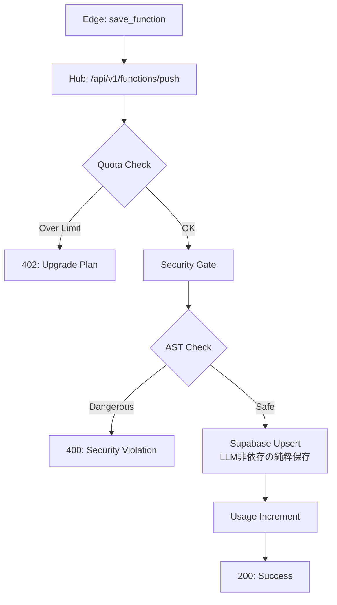

# Hub Design (Cloud Intelligence Architecture)

> [!NOTE]
> **ポートフォリオ用アーカイブ注記**
> 本ドキュメントは、クラウド側バックエンド（Hub）の詳細設計資料です。
> セキュリティ、課金、検索アルゴリズム、およびデプロイフローの実装方針について記述しています。

**最終更新日**: 2026-02-28
**バージョン**: 4.0.0

---

## 1. 責務とコア概念

Hub層は、**GCP Cloud Run 上で動作するプライベートな SaaS バックエンド**であり、LogicHive の知能の中枢である。

### 主な責務
1.  **IP（知的財産）の秘匿管理**: 組織ごとのテナント管理を実行し、Private（有料）データの漏洩を完全に防ぐ。権限管理の中枢。
2.  **効率的な永続化**: Supabase (PostgreSQL) と連携し、ステートレスな検索エンジンとして軽量かつ高速に動作する。
3.  **検索アルゴリズム**: LLMに依存しない枯れた技術（SQL ILIKE, `ORDER BY own_org DESC`等）を用いて、低コストで組織優先の検索体験を提供する。
4.  **セキュリティ・ガード**: AST 静的解析により、秘密情報（APIキー等）や危険な呼び出しを含むコードの登録を拒否する。
5.  **スクレイピング防衛**: レート制限とデータ隠蔽により、バルクダウンロード等からプラットフォームの資産を守る。
6.  **SaaS 課金管理**: Stripe と連携し、組織単位のサブスクリプション・クォータ管理を実行する。

---

## 2. コンポーネント詳細

### 2.1 FastAPI Server (`backend/hub/app.py`)

Hub のメインアプリケーション。515 行、32 のエンドポイント/データモデルを持つ。

*   **ホスティング**: GCP Cloud Run (Serverless)。アクセスがない時はインスタンスをゼロにでき、運用コストを最適化。
*   **CORS**: `localhost:3000`, `localhost:3001`, `192.168.11.7:3001`, `ayato-studio.ai`, `www.ayato-studio.ai` を許可。
*   **レート制限**: メモリベースの `RateLimiter` を搭載。同一IPからの過剰な操作を遮断する。
    | エンドポイント | 制限 |
    |:--|:--|
    | 検索 (`/functions/search`) | 10回/分/IP |
    | コード取得 (`/functions/get-code`) | 5回/分/IP |

#### エンドポイント一覧

| パス | メソッド | 認証 | 説明 |
|:--|:--|:--|:--|
| `/health` | GET | No | ヘルスチェック |
| `/api/v1/functions/public/list` | GET | No | 公開関数一覧（ポータル用） |
| `/api/v1/functions/push` | POST | X-Org-Key | 関数の保存（セキュリティ検証 + Upsert） |
| `/api/v1/functions/search` | POST | X-Org-Key | キーワード検索（自組織データ優先ソート） |
| `/api/v1/functions/get-code` | POST | X-Org-Key | 特定関数のコード取得（レート制限強） |
| `/api/v1/billing/checkout` | POST | X-Org-Key | Stripe Checkout Session 生成 |
| `/api/v1/billing/webhook` | POST | Stripe Sig | Stripe イベント受信 + DB 更新 |
| `/api/v1/billing/success` | GET | No | 決済成功ページ |
| `/api/v1/billing/cancel` | GET | No | 決済キャンセルページ |

### 2.2 Supabase Storage Engine (`backend/hub/supabase_api.py`)

Supabase との全通信を管理するシングルトンクラス（`SupabaseStorage`）。293 行、15 メソッド。

| メソッド | 説明 |
|:--|:--|
| `upsert_function()` | 関数のInsert/Update |
| `search_functions()` | PostgreSQL の標準機能を用いたテキスト検索（ILIKE）と自組織優先ソート |
| `increment_call_count()` | 関数の利用回数をインクリメント（人気度スコアリング用） |
| `check_quota()` | クォータチェック + **Lazy Monthly Reset**（月初自動リセット） |
| `increment_usage()` | 月間 API 使用回数をインクリメント |
| `get_all_functions()` | 組織内の全関数取得 |
| `get_public_functions()` | システム組織の公開関数取得（ポータル用） |
| `list_organizations()` | 全組織一覧 |
| `update_organization_billing()` | プラン変更時の DB 更新（Webhook から呼出） |
| `get_organization_id()` | API キーハッシュから組織ID解決 |

#### Lazy Monthly Reset の仕組み
`check_quota()` 内に実装された自己修復型のクォータリセット機構：

```python
# check_quota() 内のロジック概要
now = datetime.now()
last_reset = parse(data["usage_reset_date"])

if now.year > last_reset.year or now.month > last_reset.month:
    # 月が変わっている → カウントをリセット
    update(current_usage_count=0, usage_reset_date=now)
    usage = 0
```

**メリット**:
- 外部 cron ジョブ不要（pg_cron の Supabase Pro プラン依存を回避）
- 自己修復型：障害で漏れても、次の API 呼び出しで自動補正
- ステートレスアーキテクチャとの親和性が高い

### 2.3 Search Router (`backend/hub/router.py`)
ユーザーのクエリに対し、最適な関数を選別して返す。

*   **Own-Org Prioritized SQL Search**:
    1. SQL の `ILIKE` による高速なキーワード・タグ検索。
    2. `ORDER BY CASE WHEN organization_id = :my_org THEN 1 ELSE 0 END DESC` により、自組織（Private）の文脈を最優先で返却。
    3. 同率スコアの場合は `call_count` (利用回数) でソート。

（※ MVP段階では、Geminiやpgvectorを利用したAI Consolidation、Semantic Search等の高度な推論機能は除外・凍結し、ビジネス上の「IP保護」という価値証明に特化する）

### 2.5 Security Gate (`backend/core/security.py`)
*   **ASTSecurityChecker**: `exec()`, `eval()`, `subprocess`, `os.system` 等の危険な呼び出しを検知
*   **Secret Detection**: APIキー、パスワード等のハードコーディングを検出・拒否
*   **Zero-Trust Push**: Push エンドポイントで Edge 側のチェックを信頼せず、Hub 側で再検証

### 2.6 Stripe Billing (`backend/hub/stripe_api.py`)
Stripe SDK を用いた B2B 課金管理（3,366 bytes）。

| 機能 | 説明 |
|:--|:--|
| `create_customer()` | Stripe 顧客の作成（組織紐付け） |
| `get_subscription_status()` | アクティブなサブスクリプション状態を取得 |
| `create_checkout_session()` | 決済ページの URL を生成 |
| `verify_webhook_signature()` | Webhook 署名の暗号的検証 |

#### プラン定義
```python
PLAN_LIMITS = {
    "price_1T5LsGPCeWLY3R8VTNru2yRK": {"limit": 1000, "name": "basic"},   # $9/mo
    "price_1T5LsHPCeWLY3R8V9yDLnPMG": {"limit": 10000, "name": "pro"}     # $14/mo
}
# Free Plan: limit=100 (デフォルト)
```

### 2.7 Sandbox (`backend/hub/sandbox.py`)
Docker コンテナベースのセキュアなコード実行環境（3,433 bytes）。
- テストケースの実行をサンドボックス化
- タイムアウト制御（デフォルト 30秒）
- ネットワーク隔離

---

## 3. Webhook フロー



---

## 4. Push フロー詳細

関数保存（Push）時の Hub 内部処理（MVPにおける純粋なインフラロジック）。



---

## 5. Dual-Repo Architecture

Hub はプライベートリポジトリ（`LogicHive-Hub-Private`）で管理され、以下を秘匿する：
- 評価プロンプト（品質スコアリング用）
- リランキングアルゴリズム（ブースト値等）
- Stripe 設定（Price ID, Webhook Secret）
- デプロイ設定（Dockerfile, CI/CD）

---

## 6. デプロイメント

### 6.1 CI/CD パイプライン (GitHub Actions)

```yaml
# .github/workflows/deploy_hub.yml
trigger: push to master
steps:
  1. Google Auth (GCP_SA_KEY)
  2. Docker Build & Push → Artifact Registry (logichive)
  3. gcloud run deploy
     --set-env-vars:
       SUPABASE_URL, SUPABASE_SERVICE_ROLE_KEY,
       FS_GEMINI_API_KEY, MODEL_TYPE, FS_EMBEDDING_MODEL_ID,
       STRIPE_API_KEY, STRIPE_WEBHOOK_SECRET
```

### 6.2 コンテナ構成

**含まれるもの**:
*   `backend/hub/` : FastAPI サーバー、全知能ロジック
*   `backend/core/` : 共有設定、セキュリティロジック
*   `google-genai` : 推論（Embedding, Consolidation, Reranking）に必須

**除外されるもの**:
*   `duckdb`, `gitpython` : Hub はローカルファイル操作を必要としない
*   開発用ツール : テストコード、linter 等

### 6.3 環境変数

| 変数名 | 用途 | ソース |
|:--|:--|:--|
| `PORT` | サーバーポート | Cloud Run 自動設定 |
| `SUPABASE_URL` | DB URL | GitHub Secrets |
| `SUPABASE_SERVICE_ROLE_KEY` | DB 認証キー | GitHub Secrets |
| `STRIPE_API_KEY` | Stripe API キー | GitHub Secrets |
| `STRIPE_WEBHOOK_SECRET` | Webhook 署名検証キー | GitHub Secrets |

---

## 7. DB スキーマ (`backend/hub/schema.sql`)

### `organizations` テーブル
```sql
CREATE TABLE organizations (
  id UUID DEFAULT gen_random_uuid() PRIMARY KEY,
  name TEXT NOT NULL,
  api_key_hash TEXT UNIQUE,
  stripe_customer_id TEXT,
  plan_type TEXT DEFAULT 'free',          -- 'free', 'basic', 'pro'
  request_limit INT DEFAULT 100,
  current_usage_count INT DEFAULT 0,
  usage_reset_date TIMESTAMPTZ DEFAULT now(),
  status TEXT DEFAULT 'active',            -- 'active', 'frozen'
  created_at TIMESTAMPTZ DEFAULT now(),
  updated_at TIMESTAMPTZ DEFAULT now()
);
```

### `logichive_functions` テーブル
```sql
CREATE TABLE logichive_functions (
  id UUID DEFAULT gen_random_uuid() PRIMARY KEY,
  organization_id UUID REFERENCES organizations(id),
  name TEXT NOT NULL,
  code TEXT NOT NULL,
  description TEXT,
  tags JSONB DEFAULT '[]',
  dependencies JSONB DEFAULT '[]',
  embedding VECTOR(768),
  reliability_score FLOAT DEFAULT 0.5,
  call_count INT DEFAULT 0,
  metadata JSONB DEFAULT '{}',
  created_at TIMESTAMPTZ DEFAULT now(),
  updated_at TIMESTAMPTZ DEFAULT now(),
  UNIQUE(organization_id, name)
);
```

---

## 8. なぜ「知能集権化」へ舵を切ったのか？

1.  **UXの最適化**: ユーザー側のAPIキー不要（No Auth / No BYOK）で即座に価値提供。
2.  **知能の自己洗練**: 保存されたコードがAIによって自動的にタグ付けされ、利用されるほど順位が上がる「生きている知能バンク」への進化。
3.  **防衛能力の向上**: クラウド側での一元的なトラフィック制御とセキュリティ検証。
4.  **収益化基盤**: サーバーサイドでのクォータ管理により、フリーミアム SaaS モデルを実現。
