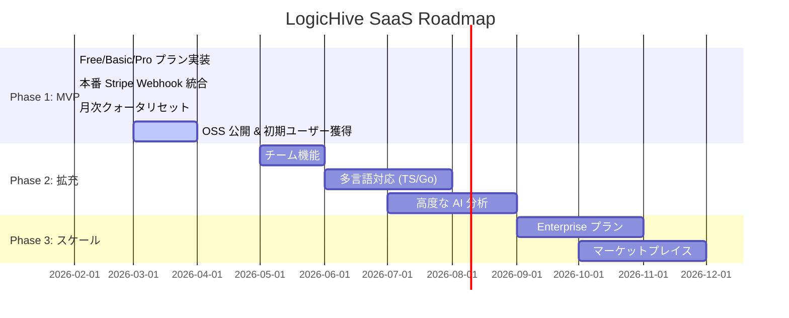

# LogicHive SaaS Strategy

> [!NOTE]
> **ポートフォリオ用アーカイブ注記**
> 本ドキュメントは、プロジェクト開発当時に作成された「ビジネス・技術戦略書」の記録です。
> 現在の本リポジトリはポートフォリオ展示用にクリーンアップされており、実装状況が本ドキュメントの「将来の計画」に先行している、あるいは戦略変更により凍結されている箇所があります。プロジェクトの全体ストーリーについては [README.md](../README.md) を参照してください。

**最終更新**: 2026-02-28

---

## 1. プロダクト・ポジショニング

LogicHive は **「AIエージェントに自社のビジネス・コンテキストを教え込む知識バンク」** である。
AIがすぐに作れる「汎用コード」ではなく、プロジェクト固有の「秘伝のタレ（作法・ルール・前提条件）」を長期記憶として保存し、検索可能にする。

### ターゲット市場
| セグメント | ペルソナ | ニーズ |
|:--|:--|:--|
| **個人開発者** | Cursor / Cline / Claude Code を使い倒す開発者 | AIが毎回独自の変数名やアーキテクチャを選ぶ「ブレ」をなくしたい |
| **スタートアップ** | 少人数チームで高速にプロダクトを構築するチーム | チーム内でコードスニペットを共有・再利用したい |
| **エンタープライズ** (将来) | 社内標準ライブラリを管理したい大規模組織 | 品質管理されたコード資産の一元管理 |

### 競合優位性
1. **MCP ネイティブ**: AIエージェントが自律的に検索・取得・活用できる唯一のコードバンク
2. **知能自動洗練**: 保存時に AI が自動でメタデータを補完し、検索精度を担保
3. **ゼロ・フリクション**: Edge（ローカル MCP サーバー）経由でエディタから即座にアクセス可能

---

## 2. 収益モデル

### 2.1 料金体系（現行 MVP）

| プラン | 月額 | 検索エンジン（知能） | データアクセス権（組織間） | 保存コードのライセンス | 主な機能と価値 |
|:--|:--|:--|:--|:--|:--|
| **Free** | $0 | **SQLキーワード検索** (自組織優先) | **他組織からのアクセス許可** | **MIT（強制・不可逆）** | 組織内での高速なコード共有（無料）と、OSSへのデータ貢献 |
| **Basic** | $9 | SQLキーワード検索 (自組織専用) | **他組織からのアクセス拒否** | **ライセンス付与なし（非公開）**| 自社の『秘伝のタレ』の完全保護と、セキュアな社内共有 |
| **Pro** | $14 | フルRAG (Future) | 他組織からのアクセス拒否 | ライセンス付与なし（非公開） | チーム全体の文脈共有（AIによる高度な検索・整理機能） |

**※技術とビジネスの極限の境界線（MVPの真髄）**:
LogicHive（MVP版）の価値は「AIの知能」ではなく、**「AIがすぐ忘れるコンテキストを保管し、チームで再利用できるインフラ」**であることにある。
そのため、MVP段階ではLLM（Gemini等）やRAG機構をバックエンドに一切搭載しない。検索はすべて高速かつコストゼロのSQL（ILIKE等）で行われる。

- **最大の課金ポイント（IPへのロックイン）**: 有料プラン（$9）へ誘導する最大の武器は「RAGの便利さ」ではなく、**「自社の社外秘ビジネスロジック（IP）を公開せずに保存できること（完全非公開）」**にある。GitHubの「パブリック無料・プライベート有料」と全く同じ、ソフトウェア業界最強にして最もシンプルなSaaSモデルである。
- **データ共有とIPの境界**: Freeプランの場合、保存したデータは「他組織へのアクセスを許可」し、LogicHive全体の共有知となる（MITライセンス付与）。Basicプランの有料ユーザーは「他組織からのアクセスを拒否」し、自社のコンテキストを完全に保護できる。
- **ライセンスの不可逆性（重要）**: プラットフォームとしてのエコシステムを守るため、**「無料プラン時に保存したデータに付与されたMITライセンスは、後から有料プランにアップグレードしても撤回できない（一律非公開にはならない）」**という強力な制約を設ける。これにより「とりあえず無料で試し、機密情報が含まれていたから後から有料にして隠す」という逃げ道を塞ぎ、最初から有料プランを契約させる強力なプレッシャーとして機能する。

### 2.2 課金の仕組み

```
ユーザー → ayato-studio.ai (Portal) → Stripe Checkout → 決済完了
                                                              ↓
                                                    Stripe Webhook
                                                              ↓
                                             Hub (Cloud Run) → Supabase 更新
                                                              ↓
                                             plan_type = "basic", request_limit = 1000
                                             current_usage_count = 0 (リセット)
```

- **決済**: Stripe Checkout Session を使用したサブスクリプション方式
- **プラン反映**: Webhook (`checkout.session.completed`) で即時反映
- **月次リセット**: Lazy Reset 方式 -- 毎月最初の API 呼び出し時に自動リセット（外部 cron 不要）
- **上限超過**: HTTP 402 を返却し、アップグレードを促す

### 2.3 コスト構造とLLM排除（純利益の最大化）

MVPにおいて不要なLLM機能を削ぎ落としたことで、有料プラン（月額$9）のほぼ全額が粗利となる究極にスリムなコスト構造を実現した。

| 項目 | 費用感 | 対象 | 備考 |
|:--|:--|:--|:--|
| **DB / Infra** | ~$0 (無料枠内) | 全員（Free/Paid） | Supabase (500MB) と Cloud Run (200万req) により、基礎スケールコストはほぼゼロ。 |
| **LLM 推論 API** | **$0** | **全員** | MVPでは不要なため完全に排除。すべての検索は高速なSQL関数（ILIKE + コサイン類似度や重み付けソート等）に依存。 |
| **Stripe 手数料** | 売上の3.6% | Paid のみ | 決済発生時のみ。 |

### 2.4 フリーミアムの境界線（The OSS Hook & Enterprise Moat）

有料化の壁（ペイウォール）において、LogicHiveは「無料＝ILIKE検索＋強制OSS公開」、「有料＝RAG（文脈検索）＋プライベート保護」という強力な境界線を引く。

#### ① 無料ユーザーに提供する価値とプラットフォームのメリット（The OSS Hook）
- **無料ユーザーのメリット**: 制限なしの関数ストレージ（ただし検索は自分でタグ等を完全一致させる必要がある）。
- **プラットフォームのメリット（究極の狙い）**: 無料で保存されたコンテキストは全て**MITライセンスとしてLogicHiveの公開データセットに貢献**される。AI時代において、汎用コードの学習データより「現場の生きたビジネス・コンテキスト」の方が圧倒的に価値が高い。これが将来的なグローバルAIの学習基盤（データモート）となる。

#### ② 有料ユーザーに提供する価値（The Enterprise Monetization）
B2Bやプロ開発者がお金を払う最大の理由は、自社の「秘伝のタレ（コンテキスト）」を学習データの餌食にせず、かつAIの力で120%再利用するためである。

- **IP保護（Private Bank）**: 保存されたコンテキストが外部に絶対に漏れないセキュアな保管庫。
- **RAGパイプライン（Librarian AI）**:
  - **Auto-Structuring**: 投げ込まれただけのコードから、Geminiが「これはCognitoの認証処理だ」等の文脈を自動抽出し、ベクトル化する。
  - **Semantic Retrieval**: 「あの時作った認証エラーの対応」という曖昧なプロンプトの意図をAIが解釈し、pgvectorでプロジェクト全体の文脈に合う最適なモジュールを引き出す。

**結論**:
無料プランはOSSコミュニティを拡大し、グローバルなデータセットを構築するための**公共の広場**。
データを非公開（社外秘）にし、かつ「文脈を理解するAI（RAG）」の力で自社の生産性を最大化したい開発者や企業から、確実にお金を取る。

---

### 2.4 フリーミアムの境界線（OSSエコシステムとEnterprise IP保護の両立）

LogicHiveのSaaSモデルにおける「有料化の壁（ペイウォール）」は、単に機能制限ではなく、**「データの公開（OSS）」か「確実なIP保護（Enterprise）」か**という、ビジネス上最も強力なインセンティブに引かれている。

#### ① 無料ユーザーとの価値交換（The OSS Data Engine）
すべてのユーザーは個別の組織（Organization ID）を持つが、無料ユーザーはシステムを利用する対価として、**自分のデータを他組織に「MITライセンス」で公開・シェアすること**を許諾する。

- **ユーザーのメリット（自組織優先の枯れた検索）**: 無料で無制限の関数・コンテキスト保管庫が使える。さらに、LLMを使わない純粋なSQL技術（`ORDER BY own_organization_id DESC` 等）により、**検索結果の最上位には必ず「自社（自組織）のコンテキスト」が優先表示される**。つまり、無料であっても「邪魔な他社のノイズ」に埋もれることなく、快適な「社内コード共有ツール」として機能する。
- **プラットフォームの最大のメリット**: ユーザーによって日々保存される「現場の生きたコンテキスト」が、合法的に（MITによって）LogicHiveの共有知となる。これが、他のAI企業には絶対に真似できない「グローバルAIのコンテキスト基盤（データモート）」を構築する。
- **💥【ルール】ライセンスの不可逆性**: 「もし有料プランにすれば、過去に保存したデータも一律で非公開（MIT撤廃）にできる」という逃げ道は用意しない。一度でも無料枠で作られた資産（MITライセンス）の撤回を許せば、他ユーザーの権利が侵害され、エコシステムが崩壊するからだ。無料プランで保存されたデータは、アップグレード後も永久に社会の資産（Public）として残り続ける。

#### ② 有料ユーザーに提供する価値（The Private IP-Bank）
B2Bやプロ開発者がお金を払う最大の理由は、自社の**「社外秘のビジネスロジック（秘伝のタレ）」**を学習データの餌食にせず、安全に社内で再利用するためである。「無料で作って後から隠す」ことはできない（不可逆ルール）ため、機密情報を扱う企業は**最初から有料プランを選ぶ**ことになり、強烈なコンバージョンを生む。

- **完全なデータの秘匿（Private Protection）**: 他組織からのアクセスを完全に遮断。保存データにMITライセンスも付与されない安全な知的財産（IP）の保管庫として機能する。「自社のコンテキストを守りながら、AIエージェントに自社専用の知識を注入できる」ことが、たった月額$9で手に入る最大の価値である。

**結論**:
無料プランはOSSコミュニティから「コンテキストデータ」を合法的かつ不可逆的に徴収し、データモートを掘るための**巨大なエコシステム・エンジン**。
秘匿性（IP保護）を求める企業に対しては、最もシンプルで枯れた技術（SQL制御）による堅牢なプライベート空間を提供し、確実にお金を取る。

| 施策 | 詳細 |
|:--|:--|
| **Private Storage の提供** | 完全プライベートな空間をエディタと繋ぐ |
| **Free プランの提供** | 参入障壁ゼロで体験させ、自社のコンテキストを蓄積させる（ロックイン） |
| **ドッグフーディング** | 自身の開発で LogicHive を使い、実績と改善点を蓄積 |

### Phase 2: プロダクト拡充期

**目標**: 有料転換率の最大化と MRR (Monthly Recurring Revenue) の確立

| 施策 | 詳細 |
|:--|:--|
| **チーム機能** | 組織内での関数共有、アクセス制御 |
| **高度な AI 分析** | コード品質レポート、依存関係マップ、セキュリティ監査 |
| **言語拡張** | Python 以外（TypeScript, Go, Rust）への対応 |
| **VSCode 拡張** | MCP を介さない直接統合オプション |

### Phase 3: スケーリング期

**目標**: ARR (Annual Recurring Revenue) の拡大と Enterprise 市場の開拓

| 施策 | 詳細 |
|:--|:--|
| **Enterprise プラン** | カスタムデプロイ、SLA、専用サポート |
| **マーケットプレイス** | 優秀な関数の売買プラットフォーム |
| **API エコノミー** | 外部サービスとの連携（CI/CD, IDE プラグイン） |

---

## 4. 技術アーキテクチャ（SaaS 観点）

### 4.1 Hybrid Edge-Cloud モデル

```
[開発者の PC]                              [クラウド]
┌───────────────┐                    ┌──────────────────────┐
│  LogicHive    │    HTTPS/REST      │    LogicHive Hub     │
│  Edge (MCP)   │ ←────────────────→ │    (Cloud Run)       │
│               │                    │                      │
│  - 関数の保存  │                    │  - 知能ルーティング    │
│  - 関数の検索  │                    │  - 品質評価           │
│  - コードの取得│                    │  - セキュリティ検証    │
└───────────────┘                    │  - 課金管理           │
                                     └──────────┬───────────┘
                                                 │
                                     ┌───────────┴──────────┐
                                     │    Supabase          │
                                     │  - pgvector (検索)    │
                                     │  - organizations     │
                                     │  - functions          │
                                     └──────────────────────┘
```

### 4.2 マルチテナンシー

- **組織ベースの分離**: 全データは `organization_id` でスコープされる
- **API キー認証**: 各組織に一意の API キーを発行（SHA-256 ハッシュで保持）
- **クォータ管理**: 組織単位で `request_limit` と `current_usage_count` を管理

### 4.3 セキュリティレイヤー

| レイヤー | 機能 |
|:--|:--|
| **AST 静的解析** | API キーやシークレットを含むコードの登録を拒否 |
| **レート制限** | IP ベースの過剰リクエスト遮断 |
| **コードマスキング** | 検索結果からソースコードを秘匿（2フェーズ取得） |
| **Stripe 署名検証** | Webhook の真正性を暗号的に保証 |
| **CORS 制御** | 許可されたオリジンからのみアクセス可能 |

---

## 5. KPI と目標指標

### MVP フェーズの KPI

| 指標 | 目標 | 測定方法 |
|:--|:--|:--|
| **総ユーザー数** | 100 | organizations テーブルの行数 |
| **月間 API コール数** | 10,000 | current_usage_count の集計 |
| **有料転換率** | 5% | plan_type != 'free' の割合 |
| **MRR** | $50 | Stripe ダッシュボード |
| **関数蓄積数** | 1,000 | logichive_functions テーブルの行数 |

### 将来的な追跡指標

- **Churn Rate**: 月間解約率（3% 以下を目標）
- **LTV (顧客生涯価値)**: 平均契約期間 x 月額単価
- **CAC (顧客獲得コスト)**: 現時点ではほぼ $0（OSS + オーガニック）

---

## 6. リスクと対策

| リスク | 影響 | 対策 |
|:--|:--|:--|
| **PMF 未達** | 「ただのファイル置き場」で終わる | Free プランでコンテキスト(Draft)を強制的に集め、LLM機能で劇的な体験を提供する |
| **大手の参入** | GitHub Copilot 等が「学習」機能を提供 | MCP ネイティブという「自社環境・外部LLM横断」のポータビリティで対抗 |
| **セキュリティ侵害** | ユーザーのコード漏洩 | AST チェック + コードマスキング + レート制限の多層防御 |
| **Supabase 無料枠超過** | コスト増 | 有料ユーザーからの収益で Pro プランへ移行 |
| **API 無料枠超過** | Google AI コスト増 | 推論の効率化 + キャッシュ戦略 |

---

## 7. ロードマップ



---

## 8. 結論

LogicHive の SaaS 戦略は **「ゼロコストで会社のコンテキスト（作法）を溜めさせ、AIの知能でその価値を掘り起こす」** という Hybrid Billing モデルに基づいている。

技術的には、Edge をステートレス化しインフラコストをほぼゼロに抑えながら、知的財産（評価ロジック、検索アルゴリズム）をクラウド側に秘匿する構成を実現している。

このモデルの最大の強みは、**「自社のコンテキスト」が蓄積されればされるほどスイッチングコストが上がる（ロックイン効果）**ことにある。汎用コードはAIが数秒で作れるが、「自社の歴史とルール」は数秒では作れない。

AIエージェント時代において「コードの再利用」ではなく「コンテキストの再利用」という真の課題を解決し、先行者優位を確立することが最優先の戦略目標である。
